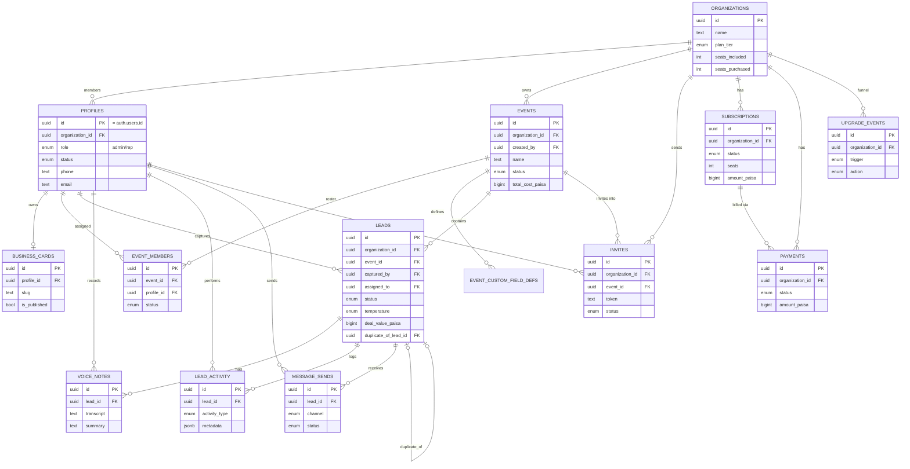

# Database Schema — Phase 1

**Backend:** Supabase (Postgres 17 + Auth + Storage)
**Project:** `Yieldd Production` — `azpanagwuskruelbwtvb`, region `ap-south-1` (Mumbai)
**Status:** **Deployed.** 11 migrations applied as of 2026-08-27 — 16 tables, 37 table policies, 14 storage-object policies, 4 buckets, 11 functions, 20 enums. `db lint` clean.

> **`supabase/migrations/` is the source of truth, not this document.** The
> narrative below explains *why* the schema is shaped the way it is and is
> still worth reading, but it describes the original 14-table design. Since
> then eight migrations have changed it. The material differences:
>
> - `events` carries **7** cost columns (Furniture and Accommodation were
>   missing), plus `stall_number` and `timezone`. `total_cost_paisa` sums all 7.
> - New tables **`message_templates`** and **`message_batches`** — the app has an
>   org-level multi-template manager with attachments, and batch sends need a
>   parent row for their progress denominator.
> - The legacy `events.whatsapp_template` / `email_template` and
>   `event_members.*_override` text columns are **dropped** in favour of FKs.
> - `leads.card_image_url` → **`card_image_path`**, `voice_notes.audio_url` →
>   **`audio_path`**, `business_cards.photo_url` → **`photo_path`**. Object keys,
>   not URLs — a URL breaks the moment the project ref changes, as it did here.
> - `business_cards` gains 6 card fields; `anon` now has an explicit **column**
>   grant instead of a table-wide one, so future columns are private by default.
> - `profiles` has a guard trigger. The original `profiles_update_self` policy
>   let any rep run `update profiles set role='admin'` on themselves — §7.2 below
>   still shows that policy, and it is no longer the whole story.
> - `handle_new_user()` now rejects a supplied-but-invalid invite token instead
>   of silently creating a stray org.
> - New: `lead_outcome` enum, `lead_activity.outcome`, `leads.reviewed_at`,
>   `invites.email`/`full_name`, `payments.event_id`,
>   `profiles.notifications_enabled`, `organizations.category`.

Grounded in [MVP_PLAN.md](MVP_PLAN.md) (features, monetization, user journey) and [ui-development-plan-v1.md](ui-development-plan-v1.md) (41-screen inventory) plus the screens already built (`app/(auth)`, `app/(app)`).

---

## 1. Design principles

1. **Tenant isolation is `organization_id`, not just `user_id`.** This is a team product — admins read every rep's leads in their event, reps sometimes peek at a colleague's note (duplicate flow). A single `organization_id` per row (checked in every RLS policy) is the real isolation boundary; `user_id`-style columns (`captured_by`, `assigned_to`, `recorded_by`) exist on top of that for attribution and per-row access, not as the isolation mechanism itself.
2. **Every signed-in user belongs to exactly one organization.** Solo Free users get an org of one. This keeps billing, plan limits, and RLS uniform instead of branching "solo vs team" logic throughout the schema. (Flag if you actually want a user to belong to >1 org later — out of scope per the MVP doc's "no cross-event benchmarking.")
3. **Two different kinds of limit, enforced two different ways** (this matters — see §8):
   - **Soft limits** (100 leads/event on Free) → *never enforced in the database.* MVP_PLAN is explicit: "Never block the scan." The app reads counts and shows the upsell sheet; the DB always accepts the insert.
   - **Hard limits** (3 voice notes on Free, 1 active event on Free) → enforced in RLS `WITH CHECK`, because the product spec actually locks these.
4. **Plan tier is never client-writable.** `organizations.plan_tier` and the entire `subscriptions`/`payments` tables are read-only to end users. Only a trusted backend (Edge Function with the service-role key, driven by a payment webhook) can write them. This is the actual mechanism behind "Pro vs Free access control" — everything else just reads this one flag.
5. **Money as `bigint` paise**, never `numeric`/`float`, to match how the MVP doc quotes everything in ₹.

---

## 2. Entity-relationship diagram



---

## 3. Enum types

```sql
create type user_role as enum ('admin', 'rep');
create type member_status as enum ('invited', 'active', 'deactivated');
create type org_plan_tier as enum ('free', 'pro');

create type event_status as enum ('upcoming', 'live', 'closed');
-- 'checkbox' and 'radio' added 2026-08-27 alongside the app's admin custom-field builder (was: 'text', 'number', 'dropdown' only).
create type custom_field_type as enum ('text', 'number', 'dropdown', 'checkbox', 'radio');

create type lead_source as enum ('card_scan', 'manual');
create type extraction_status as enum ('pending', 'completed', 'failed');
create type lead_temperature as enum ('hot', 'warm', 'cold');
create type lead_status as enum ('new', 'contacted', 'qualified', 'won', 'lost');

create type transcription_status as enum ('pending', 'processing', 'completed', 'failed');

create type activity_type as enum (
  'captured', 'assigned', 'reassigned', 'status_changed', 'temperature_set',
  'note_added', 'follow_up_set', 'outcome_logged', 'message_sent', 'merged_duplicate'
);

create type message_channel as enum ('whatsapp', 'email');
create type message_status as enum ('queued', 'sent', 'skipped', 'failed');

create type invite_status as enum ('pending', 'accepted', 'expired', 'revoked');

create type subscription_status as enum ('active', 'past_due', 'canceled', 'incomplete');
create type billing_cycle as enum ('annual', 'single_event');
create type payment_status as enum ('pending', 'success', 'failed', 'refunded');
create type upgrade_trigger as enum ('lead_wall', 'voice_lock', 'roi_curiosity', 'second_person', 'sales_manual');
create type upgrade_action as enum ('shown', 'dismissed', 'upgraded');
```

---

## 4. Tables

### 4.1 `organizations`
The billing/tenant boundary. A solo Free user is an organization of one.

```sql
create table public.organizations (
  id uuid primary key default gen_random_uuid(),
  name text not null,
  plan_tier org_plan_tier not null default 'free',
  seats_included int not null default 1,
  seats_purchased int not null default 0,
  created_at timestamptz not null default now(),
  updated_at timestamptz not null default now()
);
```

### 4.2 `profiles`
1:1 with `auth.users`. Created by trigger, never by direct client insert.

```sql
create table public.profiles (
  id uuid primary key references auth.users(id) on delete cascade,
  organization_id uuid not null references public.organizations(id) on delete restrict,
  role user_role not null default 'rep',
  status member_status not null default 'active',
  full_name text not null,
  email text not null unique,
  phone text unique,
  designation text,
  avatar_url text,
  created_at timestamptz not null default now(),
  updated_at timestamptz not null default now()
);
```
> **Confirmed:** auth is email/password (matches the built [app/(auth)/index.tsx](app/(auth)/index.tsx) screen), not MVP_PLAN's phone+OTP flow — `email` is now required, sourced directly from `auth.users.email`, which Supabase guarantees is set for email/password signup. `phone` stays optional: it's still useful as a contact field (WhatsApp follow-ups, the digital card), just no longer an auth path.

### 4.3 `invites`
Rep invitations, sent by WhatsApp only (per D3).

```sql
create table public.invites (
  id uuid primary key default gen_random_uuid(),
  organization_id uuid not null references public.organizations(id) on delete cascade,
  event_id uuid references public.events(id) on delete set null,
  invited_by uuid not null references public.profiles(id),
  phone text not null,
  role user_role not null default 'rep',
  token text not null unique,
  status invite_status not null default 'pending',
  expires_at timestamptz not null default (now() + interval '14 days'),
  accepted_at timestamptz,
  created_at timestamptz not null default now()
);
```
*(Created after `events` below — table order in an actual migration would be `organizations → profiles → events → invites → …`; listed here grouped by topic instead.)*

### 4.4 `events`
The container for every lead (Foundation layer, feature #3).

```sql
create table public.events (
  id uuid primary key default gen_random_uuid(),
  organization_id uuid not null references public.organizations(id) on delete cascade,
  created_by uuid not null references public.profiles(id),
  name text not null,
  city text,
  start_date date not null,
  end_date date not null,
  status event_status not null default 'upcoming',
  cost_stall_paisa bigint,
  cost_fabrication_paisa bigint,
  cost_travel_paisa bigint,
  cost_staff_paisa bigint,
  cost_marketing_paisa bigint,
  total_cost_paisa bigint generated always as (
    coalesce(cost_stall_paisa, 0) + coalesce(cost_fabrication_paisa, 0) +
    coalesce(cost_travel_paisa, 0) + coalesce(cost_staff_paisa, 0) +
    coalesce(cost_marketing_paisa, 0)
  ) stored,
  leaderboard_visible_to_reps boolean not null default false,
  whatsapp_template text,
  email_template text,
  created_at timestamptz not null default now(),
  updated_at timestamptz not null default now(),
  constraint events_dates_valid check (end_date >= start_date)
);
```
The five cost fields map directly to D2's five optional inputs; `total_cost_paisa` is a generated column so the ROI dashboard (H3) never has to sum client-side or drift from the source values.

### 4.5 `event_members`
Which reps/admins are on an event's roster (D3 invite, F1 "reps see their own", H2 leaderboard).

```sql
create table public.event_members (
  id uuid primary key default gen_random_uuid(),
  event_id uuid not null references public.events(id) on delete cascade,
  profile_id uuid not null references public.profiles(id) on delete cascade,
  status member_status not null default 'invited',
  whatsapp_template_override text,
  email_template_override text,
  invited_at timestamptz not null default now(),
  joined_at timestamptz,
  unique (event_id, profile_id)
);
```

### 4.6 `event_custom_field_defs`
Admin-defined fields per event (D4).

```sql
create table public.event_custom_field_defs (
  id uuid primary key default gen_random_uuid(),
  event_id uuid not null references public.events(id) on delete cascade,
  label text not null,
  field_type custom_field_type not null default 'text',
  options jsonb,
  is_required boolean not null default false,
  display_order int not null default 0,
  created_at timestamptz not null default now()
);
```
`options` holds the choice list as a JSON array of strings when `field_type` is `'dropdown'` or `'radio'`. `is_required` (added 2026-08-27) is admin-controlled per field — a rep can't save a lead in this event while a required field is empty. Enforced app-side today (the app has no live Supabase connection yet; this document stays ahead of it, as elsewhere).

### 4.7 `leads`
The core entity. Values for `event_custom_field_defs` live in `custom_field_values` (jsonb, keyed by field id) rather than a sparse EAV table — five fields max per event, never queried by value, so jsonb is the simpler fit.

```sql
create table public.leads (
  id uuid primary key default gen_random_uuid(),
  organization_id uuid not null references public.organizations(id) on delete cascade,
  event_id uuid not null references public.events(id) on delete cascade,
  captured_by uuid not null references public.profiles(id) on delete restrict,
  assigned_to uuid references public.profiles(id) on delete set null,
  source lead_source not null default 'manual',
  full_name text not null,
  company text,
  designation text,
  phone text,
  email text,
  card_image_url text,
  extraction_status extraction_status not null default 'pending',
  company_landline text,
  company_website text,
  company_address text,
  company_summary text,
  custom_field_values jsonb not null default '{}'::jsonb,
  consent_given boolean not null default false,
  consent_at timestamptz,
  note text,
  temperature lead_temperature,
  status lead_status not null default 'new',
  deal_value_paisa bigint,
  deal_closed_at timestamptz,
  follow_up_date date,
  duplicate_of_lead_id uuid references public.leads(id) on delete set null,
  saved_to_contacts boolean not null default false,
  created_at timestamptz not null default now(),
  updated_at timestamptz not null default now(),
  constraint leads_won_requires_value check (status <> 'won' or deal_value_paisa is not null)
);
```
The `leads_won_requires_value` check is the DB-level guarantee behind G4's rule: *"Value is required on Won, not optional."*

`captured_by` is `on delete restrict` — deliberately. J3 says deactivating a rep must never delete their leads; `restrict` makes that a hard guarantee at the schema level, not just an app-code convention. `assigned_to` is `on delete set null` since reassignment is expected to happen freely.

`company_landline`/`company_website`/`company_address`/`company_summary` (added 2026-08-27) back the capture screen's Company section. `company_summary` is filled by a button-triggered AI action (visits `company_website`, summarizes it in 2-3 lines) rather than automatically on save — deliberately a distinct user action so it can be gated behind a plan upgrade later without restructuring the flow, matching this product's existing pattern of visible-but-locked Pro features. Not yet wired to a real AI call anywhere (the app has no live Supabase connection at all today); the button currently returns a mocked summary client-side.

### 4.8 `voice_notes`

```sql
create table public.voice_notes (
  id uuid primary key default gen_random_uuid(),
  lead_id uuid not null references public.leads(id) on delete cascade,
  recorded_by uuid not null references public.profiles(id),
  audio_url text not null,
  duration_seconds int,
  transcript text,
  summary text,
  transcription_status transcription_status not null default 'pending',
  transcribed_at timestamptz,
  created_at timestamptz not null default now()
);
```
`audio_url` is a Supabase Storage path in a private bucket, not a public URL — signed URLs generated on read. `transcript`/`summary` are filled in server-side post-sync (your `.env` already has `DEEPGRAM_API_KEY` for transcription and presumably an LLM for the summary step).

### 4.9 `lead_activity`
Audit log / assignment history (F2), and the backing store for G2's outcome log.

```sql
create table public.lead_activity (
  id uuid primary key default gen_random_uuid(),
  lead_id uuid not null references public.leads(id) on delete cascade,
  actor_id uuid references public.profiles(id),
  activity_type activity_type not null,
  metadata jsonb not null default '{}'::jsonb,
  created_at timestamptz not null default now()
);
```
`metadata` carries type-specific detail (e.g. `{"outcome": "meeting_set", "note": "..."}` for `outcome_logged`, `{"from": "rep_a", "to": "rep_b"}` for `reassigned`) instead of a dozen sparse nullable columns.

### 4.10 `message_sends`
One row per WhatsApp/email deep-link send (F4/F5): *"Log each send against the lead."*

```sql
create table public.message_sends (
  id uuid primary key default gen_random_uuid(),
  lead_id uuid not null references public.leads(id) on delete cascade,
  sent_by uuid not null references public.profiles(id),
  channel message_channel not null,
  template_used text,
  status message_status not null default 'queued',
  batch_id uuid,
  created_at timestamptz not null default now()
);
```
`batch_id` groups a single bulk-send session (F4 → F5) so you can show "6 of 8 sent" progress.

### 4.11 `business_cards`
Digital card (C1/C2, A3, J2). One per profile — multi-card is explicitly out of scope.

```sql
create table public.business_cards (
  id uuid primary key default gen_random_uuid(),
  profile_id uuid not null unique references public.profiles(id) on delete cascade,
  slug text not null unique,
  display_name text not null,
  designation text,
  company_name text,
  phone text,
  email text,
  photo_url text,
  is_published boolean not null default true,
  created_at timestamptz not null default now(),
  updated_at timestamptz not null default now()
);
```
No view-count/analytics columns — MVP_PLAN explicitly lists "view analytics on the hosted card" as out of scope for Phase 1.

### 4.12 `subscriptions`

```sql
create table public.subscriptions (
  id uuid primary key default gen_random_uuid(),
  organization_id uuid not null references public.organizations(id) on delete cascade,
  plan org_plan_tier not null default 'pro',
  status subscription_status not null default 'active',
  billing_cycle billing_cycle not null default 'annual',
  seats int not null default 5,
  amount_paisa bigint not null,
  currency text not null default 'INR',
  provider text not null default 'razorpay',
  provider_subscription_id text,
  current_period_start timestamptz not null,
  current_period_end timestamptz not null,
  cancel_at_period_end boolean not null default false,
  created_at timestamptz not null default now(),
  updated_at timestamptz not null default now()
);
```
> **No payment gateway registered yet.** The table and its `provider` column (defaulted to `'razorpay'` as a placeholder — swap freely once you've actually registered with one) exist so the shape is ready, but no billing webhook / Edge Function will be built until you share real gateway credentials. Until then every organization simply stays on `plan_tier = 'free'` (its table default) — there's nothing to wire up, no code sits idle waiting on secrets that don't exist yet. When you're ready, come back with the provider + credentials and I'll add the webhook handler that writes into `subscriptions`/`payments` and flips `organizations.plan_tier`.

### 4.13 `payments`
Billing/GST invoice history (J1, I3).

```sql
create table public.payments (
  id uuid primary key default gen_random_uuid(),
  organization_id uuid not null references public.organizations(id) on delete cascade,
  subscription_id uuid references public.subscriptions(id) on delete set null,
  amount_paisa bigint not null,
  currency text not null default 'INR',
  status payment_status not null default 'pending',
  provider_payment_id text,
  gst_invoice_url text,
  trigger_source upgrade_trigger,
  created_at timestamptz not null default now()
);
```
`trigger_source` records which of the four upgrade moments led to this payment — direct funnel attribution.

### 4.14 `upgrade_events`
Funnel tracking for the four upgrade triggers (I1/I2) — this is the "usage tracking" piece of monetization, separate from billing history.

```sql
create table public.upgrade_events (
  id uuid primary key default gen_random_uuid(),
  organization_id uuid not null references public.organizations(id) on delete cascade,
  profile_id uuid not null references public.profiles(id) on delete cascade,
  trigger upgrade_trigger not null,
  action upgrade_action not null,
  created_at timestamptz not null default now()
);
```

---

## 5. Indexes

```sql
create index on public.profiles (organization_id);
create index on public.events (organization_id);
create index on public.event_members (profile_id);
create index on public.event_custom_field_defs (event_id);
create index on public.invites (organization_id);
create index on public.invites (token);

create index on public.leads (organization_id);
create index on public.leads (event_id);
create index on public.leads (captured_by);
create index on public.leads (assigned_to);
create index on public.leads (phone);
create index on public.leads (follow_up_date) where follow_up_date is not null;
create index on public.leads (event_id, status);

create index on public.voice_notes (lead_id);
create index on public.lead_activity (lead_id);
create index on public.message_sends (lead_id);
create index on public.message_sends (batch_id);

create index on public.subscriptions (organization_id);
create index on public.payments (organization_id);
create index on public.upgrade_events (organization_id);
```
The `leads.phone` index backs duplicate detection (E4); `event_id, status` backs the pipeline views (G3) and dashboard aggregates (H2/H3).

---

## 6. Helper functions (used throughout RLS)

These exist specifically to avoid a classic Supabase footgun: a policy on `profiles` that queries `profiles` to check organization membership recurses infinitely. Wrapping the lookup in a `security definer` function breaks that recursion, because the function runs with the definer's privileges rather than re-evaluating the caller's RLS.

```sql
create or replace function public.current_organization_id()
returns uuid
language sql security definer set search_path = public stable
as $$
  select organization_id from public.profiles where id = auth.uid();
$$;

create or replace function public.is_admin()
returns boolean
language sql security definer set search_path = public stable
as $$
  select coalesce(
    (select role from public.profiles where id = auth.uid()) = 'admin',
    false
  );
$$;

create or replace function public.org_is_pro()
returns boolean
language sql security definer set search_path = public stable
as $$
  select coalesce(
    (select plan_tier from public.organizations where id = public.current_organization_id()) = 'pro',
    false
  );
$$;
```

---

## 7. Row Level Security

Enable on every table; deny-by-default (no policy = no access) except where a policy explicitly grants it.

### 7.1 `organizations`
```sql
alter table public.organizations enable row level security;

create policy "org_select_members" on public.organizations
for select using (id = public.current_organization_id());

create policy "org_admin_update_name" on public.organizations
for update using (id = public.current_organization_id() and public.is_admin())
with check (id = public.current_organization_id());

-- Column-level lock: even an admin's UPDATE above can only ever touch `name`.
-- plan_tier / seats_* are writable only by the service role (billing webhook).
revoke update on public.organizations from authenticated;
grant update (name) on public.organizations to authenticated;
```

### 7.2 `profiles`
```sql
alter table public.profiles enable row level security;

create policy "profiles_select_self_or_org" on public.profiles
for select using (
  id = auth.uid() or organization_id = public.current_organization_id()
);

create policy "profiles_update_self" on public.profiles
for update using (id = auth.uid()) with check (id = auth.uid());

create policy "profiles_admin_manage_status" on public.profiles
for update using (organization_id = public.current_organization_id() and public.is_admin())
with check (organization_id = public.current_organization_id());

-- No insert policy: rows are created only by handle_new_user() (security definer trigger).
```

### 7.3 `invites`
```sql
alter table public.invites enable row level security;

create policy "invites_admin_all" on public.invites
for all using (organization_id = public.current_organization_id() and public.is_admin())
with check (organization_id = public.current_organization_id() and public.is_admin());
```
No public/anon read policy — the token is validated server-side inside the signup trigger (§8.1), never fetched by an unauthenticated client.

### 7.4 `events`
```sql
alter table public.events enable row level security;

create policy "events_select_members" on public.events
for select using (
  organization_id = public.current_organization_id()
  and (
    public.is_admin()
    or exists (select 1 from public.event_members em where em.event_id = events.id and em.profile_id = auth.uid())
  )
);

create policy "events_admin_insert" on public.events
for insert with check (
  organization_id = public.current_organization_id()
  and public.is_admin()
  and created_by = auth.uid()
  and (
    public.org_is_pro()
    or (select count(*) from public.events e
        where e.organization_id = public.current_organization_id()
          and e.status in ('upcoming', 'live')) = 0
  )
);

create policy "events_admin_update" on public.events
for update using (organization_id = public.current_organization_id() and public.is_admin())
with check (organization_id = public.current_organization_id());

create policy "events_admin_delete" on public.events
for delete using (organization_id = public.current_organization_id() and public.is_admin());
```
The `events_admin_insert` check is the hard enforcement of "Free = 1 active event" (H1) — a Free org's second `upcoming`/`live` event insert is rejected outright, not just discouraged in the UI.

### 7.5 `event_members`
```sql
alter table public.event_members enable row level security;

create policy "event_members_select" on public.event_members
for select using (
  exists (select 1 from public.events e where e.id = event_members.event_id and e.organization_id = public.current_organization_id())
  and (
    public.is_admin()
    or profile_id = auth.uid()
    or exists (select 1 from public.events e2 where e2.id = event_members.event_id and e2.leaderboard_visible_to_reps)
  )
);

create policy "event_members_admin_write" on public.event_members
for all using (
  exists (select 1 from public.events e where e.id = event_members.event_id and e.organization_id = public.current_organization_id())
  and public.is_admin()
)
with check (
  exists (select 1 from public.events e where e.id = event_members.event_id and e.organization_id = public.current_organization_id())
);
```

### 7.6 `event_custom_field_defs`
```sql
alter table public.event_custom_field_defs enable row level security;

create policy "field_defs_select_members" on public.event_custom_field_defs
for select using (
  exists (
    select 1 from public.events e
    join public.event_members em on em.event_id = e.id
    where e.id = event_custom_field_defs.event_id
      and e.organization_id = public.current_organization_id()
      and (public.is_admin() or em.profile_id = auth.uid())
  )
);

create policy "field_defs_admin_write" on public.event_custom_field_defs
for all using (
  exists (select 1 from public.events e where e.id = event_custom_field_defs.event_id and e.organization_id = public.current_organization_id())
  and public.is_admin()
)
with check (
  exists (select 1 from public.events e where e.id = event_custom_field_defs.event_id and e.organization_id = public.current_organization_id())
);
```

### 7.7 `leads`
```sql
alter table public.leads enable row level security;

create policy "leads_select_own_or_admin" on public.leads
for select using (
  organization_id = public.current_organization_id()
  and (public.is_admin() or captured_by = auth.uid() or assigned_to = auth.uid())
);

create policy "leads_insert_event_member" on public.leads
for insert with check (
  organization_id = public.current_organization_id()
  and captured_by = auth.uid()
  and exists (
    select 1 from public.event_members em
    where em.event_id = leads.event_id and em.profile_id = auth.uid() and em.status = 'active'
  )
  -- Deliberately NO count check here — the 100-lead Free cap is a soft,
  -- app-level upsell prompt, not a database gate. See design note in §8.2.
);

create policy "leads_update_own_or_admin" on public.leads
for update using (
  organization_id = public.current_organization_id()
  and (public.is_admin() or captured_by = auth.uid() or assigned_to = auth.uid())
)
with check (organization_id = public.current_organization_id());

create policy "leads_delete_admin_only" on public.leads
for delete using (organization_id = public.current_organization_id() and public.is_admin());
```
Reassignment (`assigned_to`) is further locked to admins by a trigger, not by this policy — see §8.3, because Postgres column-level `GRANT` can't be conditional on role membership the way a trigger can.

### 7.8 `voice_notes`
```sql
alter table public.voice_notes enable row level security;

create policy "voice_notes_select" on public.voice_notes
for select using (
  exists (
    select 1 from public.leads l
    where l.id = voice_notes.lead_id
      and l.organization_id = public.current_organization_id()
      and (public.is_admin() or l.captured_by = auth.uid() or l.assigned_to = auth.uid())
  )
);

create policy "voice_notes_insert" on public.voice_notes
for insert with check (
  recorded_by = auth.uid()
  and exists (select 1 from public.leads l where l.id = voice_notes.lead_id and l.organization_id = public.current_organization_id())
  and (
    public.org_is_pro()
    or (
      select count(*) from public.voice_notes vn
      join public.leads l2 on l2.id = vn.lead_id
      where l2.organization_id = public.current_organization_id()
    ) < 3
  )
);
```
This `WITH CHECK` is the hard enforcement of "3 free voice notes, then locked" — the fourth `insert` on a Free org is rejected at the database, matching the pricing table's actual promise (unlike the lead cap, which is soft).

### 7.9 `lead_activity`
```sql
alter table public.lead_activity enable row level security;

create policy "lead_activity_select" on public.lead_activity
for select using (
  exists (
    select 1 from public.leads l
    where l.id = lead_activity.lead_id
      and l.organization_id = public.current_organization_id()
      and (public.is_admin() or l.captured_by = auth.uid() or l.assigned_to = auth.uid())
  )
);

create policy "lead_activity_insert" on public.lead_activity
for insert with check (
  actor_id = auth.uid()
  and exists (
    select 1 from public.leads l
    where l.id = lead_activity.lead_id
      and l.organization_id = public.current_organization_id()
      and (public.is_admin() or l.captured_by = auth.uid() or l.assigned_to = auth.uid())
  )
);
```

### 7.10 `message_sends`
```sql
alter table public.message_sends enable row level security;

create policy "message_sends_select" on public.message_sends
for select using (
  exists (
    select 1 from public.leads l
    where l.id = message_sends.lead_id
      and l.organization_id = public.current_organization_id()
      and (public.is_admin() or l.captured_by = auth.uid() or l.assigned_to = auth.uid())
  )
);

create policy "message_sends_insert" on public.message_sends
for insert with check (
  sent_by = auth.uid()
  and exists (
    select 1 from public.leads l
    where l.id = message_sends.lead_id
      and l.organization_id = public.current_organization_id()
      and (public.is_admin() or l.captured_by = auth.uid() or l.assigned_to = auth.uid())
  )
);
```

### 7.11 `business_cards`
```sql
alter table public.business_cards enable row level security;

-- Public: the hosted card page (A3) is unauthenticated, so `anon` must be able to read it.
create policy "business_cards_public_read" on public.business_cards
for select using (is_published = true);
grant select on public.business_cards to anon;

create policy "business_cards_owner_manage" on public.business_cards
for all using (profile_id = auth.uid()) with check (profile_id = auth.uid());
```

### 7.12 `subscriptions` / `payments` / `upgrade_events`
```sql
alter table public.subscriptions enable row level security;
alter table public.payments enable row level security;
alter table public.upgrade_events enable row level security;

create policy "subscriptions_admin_read" on public.subscriptions
for select using (organization_id = public.current_organization_id() and public.is_admin());

create policy "payments_admin_read" on public.payments
for select using (organization_id = public.current_organization_id() and public.is_admin());

-- No insert/update/delete policies on subscriptions or payments for `authenticated`.
-- Writes happen exclusively via the service-role key inside a payment-webhook Edge Function.

create policy "upgrade_events_insert_self" on public.upgrade_events
for insert with check (profile_id = auth.uid() and organization_id = public.current_organization_id());

create policy "upgrade_events_admin_read" on public.upgrade_events
for select using (organization_id = public.current_organization_id() and public.is_admin());
```

---

## 8. Functions & triggers

### 8.1 Signup → profile + organization (or attach to an invite)

```sql
create or replace function public.handle_new_user()
returns trigger
language plpgsql security definer set search_path = public
as $$
declare
  v_invite public.invites%rowtype;
  v_org_id uuid;
begin
  select * into v_invite
  from public.invites
  where token = new.raw_user_meta_data ->> 'invite_token'
    and status = 'pending'
    and expires_at > now()
  limit 1;

  if found then
    v_org_id := v_invite.organization_id;

    insert into public.profiles (id, organization_id, role, full_name, email)
    values (
      new.id, v_org_id, v_invite.role,
      coalesce(new.raw_user_meta_data ->> 'full_name', 'New user'),
      new.email
    );

    update public.invites set status = 'accepted', accepted_at = now() where id = v_invite.id;

    if v_invite.event_id is not null then
      insert into public.event_members (event_id, profile_id, status, joined_at)
      values (v_invite.event_id, new.id, 'active', now());
    end if;
  else
    insert into public.organizations (name)
    values (coalesce(new.raw_user_meta_data ->> 'company_name', 'My workspace'))
    returning id into v_org_id;

    insert into public.profiles (id, organization_id, role, full_name, email)
    values (
      new.id, v_org_id, 'admin',
      coalesce(new.raw_user_meta_data ->> 'full_name', 'New user'),
      new.email
    );
  end if;

  return new;
end;
$$;

create trigger on_auth_user_created
  after insert on auth.users
  for each row execute function public.handle_new_user();
```
First user in ⇒ `admin` of a brand-new org. `new.email` comes straight from `auth.users` (guaranteed for email/password signup); `full_name` and `company_name` are passed as signup metadata — i.e. `supabase.auth.signUp({ email, password, options: { data: { full_name, company_name } } })`, matching the "Full name" / "Company name" fields already in [app/(auth)/index.tsx](app/(auth)/index.tsx). Rep invite links add `invite_token` to that same metadata object so the trigger attaches them to the existing org + event instead of creating a new one.

### 8.2 `updated_at` maintenance (generic)
```sql
create or replace function public.set_updated_at()
returns trigger language plpgsql as $$
begin
  new.updated_at = now();
  return new;
end;
$$;

create trigger trg_org_updated_at before update on public.organizations for each row execute function public.set_updated_at();
create trigger trg_profiles_updated_at before update on public.profiles for each row execute function public.set_updated_at();
create trigger trg_events_updated_at before update on public.events for each row execute function public.set_updated_at();
create trigger trg_cards_updated_at before update on public.business_cards for each row execute function public.set_updated_at();
create trigger trg_subs_updated_at before update on public.subscriptions for each row execute function public.set_updated_at();
```

### 8.3 Lead update guard (reassignment is admin-only; a few fields are immutable)
```sql
create or replace function public.enforce_lead_update_rules()
returns trigger language plpgsql security definer set search_path = public
as $$
begin
  if new.assigned_to is distinct from old.assigned_to and not public.is_admin() then
    raise exception 'Only an admin can reassign a lead';
  end if;
  if new.captured_by is distinct from old.captured_by then
    raise exception 'captured_by is immutable';
  end if;
  if new.organization_id is distinct from old.organization_id then
    raise exception 'organization_id is immutable';
  end if;
  new.updated_at = now();
  return new;
end;
$$;

create trigger trg_leads_before_update
  before update on public.leads
  for each row execute function public.enforce_lead_update_rules();
```
This is why `leads` isn't in the generic `set_updated_at` list above — it needs its own trigger anyway, so `updated_at` is handled here.

### 8.4 Duplicate-lead peek (E4)
E4's spec is narrow on purpose: *"Read access only, and only at the moment a duplicate fires. Reps do not browse each other's leads."* The general `leads` SELECT policy (§7.7) already blocks a rep from browsing another rep's rows — so the one-time peek needs its own narrow door, not a loosened table policy:

```sql
create or replace function public.find_duplicate_lead(p_event_id uuid, p_phone text)
returns table (
  lead_id uuid,
  captured_by_name text,
  captured_at timestamptz,
  note text,
  voice_summary text
)
language sql security definer set search_path = public stable
as $$
  select l.id, p.full_name, l.created_at, l.note, vn.summary
  from public.leads l
  join public.profiles p on p.id = l.captured_by
  left join public.voice_notes vn on vn.lead_id = l.id
  where l.event_id = p_event_id
    and l.phone = p_phone
    and l.organization_id = public.current_organization_id()
  order by l.created_at asc
  limit 1;
$$;
```
Called from the app right after a scan/manual entry, before save — returns just enough for the "Rajesh captured this contact yesterday — view his note?" prompt, nothing more.

---

## 9. Design decisions flagged for your review

1. ~~Payment provider~~ — **resolved: deferred.** No gateway is registered yet. `subscriptions`/`payments` tables get built now (so the schema is ready), but the actual billing webhook / Edge Function is on hold until you register a provider and share credentials — every org stays on `plan_tier = 'free'` until then.
2. **Soft vs. hard limits, restated:** 100-lead cap = never blocked in DB (app-level upsell only). 1-active-event and 3-voice-note caps = actually enforced in RLS `WITH CHECK`. If you want the lead cap enforced in the DB too as a second layer (defense in depth, app bug can't accidentally let someone past it), say so — MVP_PLAN's wording is explicit enough that I left it soft, but it's a one-line addition either way.
3. **Single admin per org isn't enforced.** Nothing stops two profiles both being `role = 'admin'` in the same org — deliberately, since nothing in the docs rules it out and it costs nothing to allow.
4. **No table for card-view analytics** — MVP_PLAN explicitly lists this out of scope; flagging so it's clear it was considered and dropped, not missed.
5. **Storage buckets** (card images, voice audio) aren't part of this schema (Postgres tables only) — you'll want two private Supabase Storage buckets (`card-images`, `voice-notes`) with policies mirroring the `leads`/`voice_notes` RLS above. Happy to spec those too if useful.
6. **`event_status` isn't auto-transitioned.** Nothing flips `upcoming → live → closed` automatically based on `start_date`/`end_date`. Either the app sets it explicitly, or a small `pg_cron` nightly job does it — didn't want to guess which without asking.

~~Auth method mismatch~~ — **resolved: email/password**, reflected in `profiles` (§4.2) and the signup trigger (§8.1).

---

## 10. Explicitly not modeled (matches MVP_PLAN §"deliberately not in Phase 1")

Web admin dashboard, kiosk mode, catalogue microsites, lead scoring, cross-event comparison, notification centre, territory/role-permission hierarchies, lead routing rules, approval workflows, multi-card profiles, NFC, card themes/branding, card view analytics.
